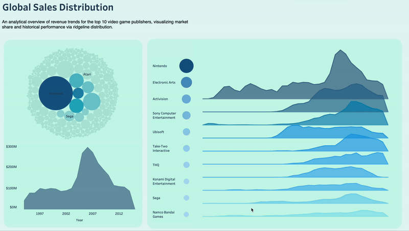
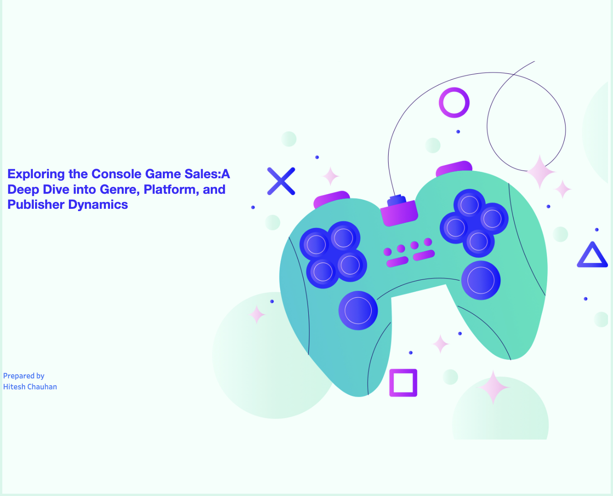

# Hi there, I'm Hitesh 𓆉
### Machine Learning & Data Science Professional | Software Engineering Background

I enjoy building things with data — from research-driven machine learning projects to experimental visualizations that explore new ways of representing information.

This space is a collection of my academic work, personal projects, and ongoing research.

When I’m not working with data, you’ll probably find me hiking 🏔️ or swimming 🌊.

 

---

## 🚀 Explore Projects by Skill
*Click a button below to jump to relevant projects.*

[-007ACC?style=for-the-badge&logo=tableau&logoColor=white)](#-data-visualization--analytics)

---

## 🧠 Machine Learning & Artificial Intelligence
*Focus: Predictive Modeling, Computer Vision, Evolutionary Algorithms*

### 🌲 [Ishkode - Evolutionary Wildfire Prediction](https://github.com/hit-rajput/forest-fire-prediction) 
**Tools:** `Python` `Genetic Algorithms` `KDTree` `Scikit-Learn`
A research initiative proposing a novel **Genetic Algorithm (GA)** to optimize feature selection for detecting "Mega-Fire" events in the Cariboo region.
* **Methodology:** Implemented **KDTree spatial indexing** to accurately merge satellite fire perimeters with ERA5 weather station data.
* **Key Innovation:** Moves beyond standard classification to handle high-imbalance datasets (rare extreme events).

### 🎭 [Hybrid Facial Emotion Recognition (FER)](https://github.com/hit-rajput/sentiment_analysis)
**Tools:** `Python` `TensorFlow/Keras` `OpenCV` `MATLAB`
A hybrid computer vision system classifying 7 distinct human emotions with superior robustness to lighting changes.
* **Innovation:** Integrated **CNNs** with manual feature descriptors (**HOG + SIFT**) to stabilize learning curves.
* **Outcome:** Outperformed standard CNN baselines on the CK+ dataset by capturing local geometric facial features.

---
## 📊 Data Visualization & Analytics
*Focus: Business Analysis, Dashboarding, KPI Tracking, Data Storytelling*

### 🎮 [Global Gaming Market Analysis (1980-2016)](https://public.tableau.com/app/profile/hitesh.rajputh/viz/global_sales_distribution_Rideline/GLobalSalesDistribution)
**Tools:** `Tableau` `Ridgeline Plots` `Contextual Filtering` `UX/UI Design`
A technical exploration of industry dominance, featuring custom-built **Ridgeline Plots** and **Packed Bubble Charts** to visualize the market share of key publishers.

* **The Challenge:** Standard charts often fail to show individual trajectories against a global backdrop effectively.
* **The Solution (Contextual Filtering):** Engineered a complex hover interaction where interacting with the ridgeline distribution automatically filters the bottom Area Chart. This allows users to instantly compare a specific publisher's lifecycle (e.g., Nintendo's Wii-era spike) against total global sales volume in real-time.

### 🌲 [Canadian Forest Fire Analytics (Tableau Story)](https://public.tableau.com/views/CanadianForestFIres/FInalStory?:language=en-US&:sid=&:redirect=auth&:display_count=n&:origin=viz_share_link)
**Tools:** `Tableau` `Data Cleaning` `Geospatial Analysis`
A comprehensive data story identifying the trends using 10+ years of historical data.

* **Interactive Animation:** Engineered an **animation-based geospatial map** that visualizes the velocity and density of fire spread throughout the year, allowing stakeholders to pinpoint peak risk windows.
* **Analyst Insight:** Correlated lightning-caused fires with higher intensity/area burned compared to human-caused fires, influencing resource allocation strategies for remote regions.

### 📊 [Global Console Game Sales Intelligence (Tableau)](https://public.tableau.com/views/Game_console/Story1?:language=en-US&:sid=&:redirect=auth&:display_count=n&:origin=viz_share_link)
**Tools:** `Tableau` `Statistical Analysis` `Market Segmentation`
A deep-dive strategic dashboard exploring market dynamics across genres, platforms, and publishers (1980–2015).

| Analytical Dimension | Key Analyst Responsibilities & Insights |
| :--- | :--- |
| **Genre Trends** | **Trend Analysis:** Mapped the rise and fall of genre popularity over 35 years, identifying the "Action" genre as a consistent high-performer. |
| **Platform Wars** | **Performance Benchmarking:** Evaluated the lifecycle success of top 3 platforms, visualizing the "Console War" dominance shifts. |
| **Regional Harmony** | **Correlation Analysis:** Discovered a strong linear correlation between NA and EU sales markets, suggesting unified marketing campaigns are effective. |

### 🩸 [Supply Risk Monitor (Power BI)](https://github.com/Hit-rajput/blood-supply-risk-monitor)
**Tools:** `Power BI` `Predictive Risk Modeling` `Forecasting`
A prescriptive analytics system forecasting trauma-driven blood demand against donor supply capacity.
* **Goal:** Shifts healthcare logistics from descriptive reporting to prescriptive risk modeling.
* **Key Question:** "Given forecasted weather conditions and historical donor patterns, what is the probability of a supply deficit?"

---

## 💻 Cloud & Software Engineering
*Focus: Backend Development, Cloud Infrastructure, Database Management*

### ☁️ Evolutionary Algorithm Backend on GCP
**Tools:** `Google Cloud Platform` `MATLAB` `API Integration`
Engineered the orchestration of API calls between a frontend interface and a GCP-hosted MATLAB microservice performing complex forensic evolutionary algorithms.
* **Role:** Managed scalable deployment and seamless user experience for a top-performing North American research team.

### 📱 Production Data Engineering
**Tools:** `SQL` `Firebase` `NoSQL`
Experience managing production-level data systems at Advance Infotech.
* **Database Management:** Leveraged **SQL** alongside **Google Firebase** to manage complex datasets for mobile applications.
* **Security:** Built robust back-end integrations ensuring data integrity and secure retrieval.

---

## 🛠 Technical Toolkit

| Category | Skills |
| :--- | :--- |
| **Machine Learning** | Scikit-learn, TensorFlow, CNNs, Genetic Algorithms, OpenCV |
| **Data Viz & BI** | **Tableau**, **Power BI**, DAX, Storytelling, Matplotlib, Seaborn |
| **Languages** | **Python**, **SQL**, R, MATLAB, C++ |
| **Data Engineering** | Pandas, NumPy, Data Cleaning, Spatial Indexing (KDTree) |
| **Cloud & Tools** | Google Cloud Platform (GCP), Firebase, Git, Jupyter |

---
*Connect with me on [LinkedIn](https://www.linkedin.com/in/hitesh-rajput-4467b1b9/) to discuss opportunities in Data Science and AI.*
